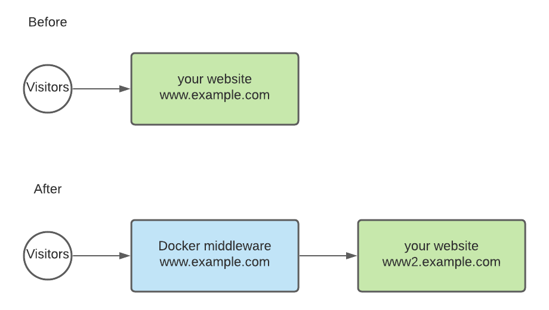

# Prerender docker middleware

This standalone docker component can be used as a middleware to prerender your website with [Prerender.io](https://prerender.io) when you can’t use other middlewares (or simply when you prefer to do it this way).

## How-To



1. Assign a secondary domain to your website.

E.g. if your website is `www.example.com` (primary domain), then point `www2.example.com` (secondary domain) to your website too.

> Don't add the secondary domain name as a CNAME for your primary domain, as you will need to re-point your primary domain to this docker component at the end of the setup. Use an A or AAAA record instead. Or use a CNAME that is provided by your hosting provider, but **doesn't match your primary domain**.

2. Edit the `Dockerfile` to match your settings.

Set your secondary domain, primary domain and API key. You may want to use environment variables later, but we suggest you do it in the file first to avoid environment compatibility issues during your first setup.

3. **Optional:** At this point, you can test your setup locally by running the docker container on your computer. For this, you need to have a configured [Docker Engine](https://docs.docker.com/engine/install/) or [Docker desktop](https://docs.docker.com/desktop/) running on your computer.

```bash
make run
curl http://localhost:8080
```

4. Setup this docker container to run as a standalone server.

This step highly depends on your infrastructure so it's hard to give you more suggestions here. Still, a common step is to upload this dockerfile to a component-based cloud provider, such as [Digital Ocean App Platform](https://docs.digitalocean.com/products/app-platform/languages-frameworks/docker/), [Heroku](https://devcenter.heroku.com/categories/deploying-with-docker), [AWS ECS](https://docs.aws.amazon.com/AmazonECS/latest/developerguide/getting-started.html) or [Elastic Beanstalk](https://docs.aws.amazon.com/elasticbeanstalk/latest/dg/create_deploy_docker.html). Or use your already existing, Docker-capable kubernetes cluster, as you like.

5. Point your primary domain to this new component.

> At this point you're good to use a CNAME too, as this is a brand new component.

6. Test

Send a few request to your primary domain using `curl`, and see how it responds to different user agents.

### Emulate a normal user request

> The user agent could be anything that doesn't look like a bot, we just added something here for clarity.

```bash
curl -A Chrome https://www.example.com
```

### Emulate a bot request

```bash
curl -A Googlebot https://www.example.com
```

> Optional: You can even set your secondary domain to be authenticated (e.g. with basic auth), so then it will never be indexed by Google, and modify the nginx config to send the authentication along with the request.
